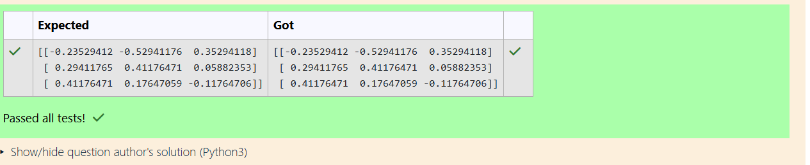

# INVERSE-OF-A-MATRIX
## Aim:
To write a python program to find the inverse of a matrix
## Equipment’s required:
1. 	Hardware – PCs
2. 	Anaconda – Python 3.7 Installation / Moodle-Code Runner
## Algorithm:
### Step1 : Define the matrix 
A (in this case, a 3x3 matrix).
Example matrix A is 
A = ​[1,0,3][-1,2,-2][2,3,-1]
### Step 2:Ensure that the matrix 
A is square (i.e., it has the same number of rows and columns).
Compute the determinant of the matrix. If the determinant is zero, the matrix is singular and does not have an inverse.
### Step 3: Use the formula for the inverse of a matrix, or use a computational method like Gaussian elimination or LU decomposition. In this case, NumPy's np.linalg.inv() function is used to calculate the inverse directly.
### Step 4:The result of np.linalg.inv(a) is the inverse of the matrix 
𝐴
A. Print the inverse matrix.
For example, if the inverse exists, output will be a new matrix A-1
## Program:
#Program to find the inverse of a matrix.
#Developed by:RAGUL K.R 
#RegisterNumber:24900660
import numpy as np
a=np.array([[1,0,3],[-1,2,-2],[2,3,-1]])
res=np.linalg.inv(a)
print(res)

## Output:
ra

## Result:

Thus the inverse of given matrix is successfully solved using python program

